# GroupChat 整体架构与数据流图（开发唯一基准）

> 版本：v1.2（2026-08-18）
> 适用范围：本仓库所有后续开发、重构、验收与交接
> 状态：v1.0-v1.2 与 `feat/group-chat-implementation` 分支当前实现一致；4.11「加入房间三入口」已实现（提交 e0440ba / 5996e12 / 863067f / 3c82364）

## 0. 使用规范（每次开发前必读）

**本文档是项目的唯一架构事实来源。** 第 2 节的架构图是开发时不得偏离的基准：

1. 任何新增/修改功能，必须能落到第 2 节架构图的某个分层与模块中；新增模块不得绕过既有分层（例如渲染进程直接使用 Node API、业务逻辑写进路由层、绕过 repository 直连 Prisma）。
2. 客户端系统能力（通知、托盘角标、链接预览、窗口控制）一律走 `preload → contextBridge → ipcMain`，渲染进程不直接触碰 Node/Electron API。
3. 实时数据一律走 Socket.io（消息广播、在线状态、输入状态、AI 流式）；查询/写库类一次性操作走 REST `/api/v1`。通道选择不得随意互换。
4. 数据模型变更必须更新第 3 节 ER 图并新增 Prisma migration；Socket 事件与 REST 接口变更必须同步更新第 6 节接口清单。
5. 架构若需调整，先改本文档（版本号 +1 并记录变更），再动代码；代码与本文档不一致时以本文档为准并修复代码。

---

## 1. 项目总览

**一句话**：Electron 30+ / React 19 桌面群聊应用，支持实时文字聊天（Socket.io）、房间/未读/在线状态、虚拟列表、托盘通知、WebContentsView 链接预览、AI 机器人流式回复（SSE → Socket 转发），后端 Node/Express + Prisma + MySQL 8，Docker 部署方案就绪。

**技术栈基线**：

| 层 | 技术 | 版本 |
|---|---|---|
| 桌面框架 | Electron + electron-vite | 30+ / 2.x |
| 渲染层 | React + TypeScript + Ant Design | 19 / 5.4 / 6.x |
| 状态管理 | Zustand | 5.x |
| 虚拟列表 | @tanstack/react-virtual | 3.x |
| HTTP | axios | 1.x |
| 实时 | socket.io / socket.io-client | 4.x |
| 后端 | Node.js + Express + TypeScript | 20 / 4.x |
| ORM | Prisma | 6.19.3（MySQL 8.0） |
| 校验 | express-validator | 7.x |
| 认证 | JWT + bcryptjs | — |
| 日志 | pino + pino-pretty | — |
| 部署 | Docker Compose + Nginx | mysql:8.0 / nginx:stable-alpine |

**非目标（MVP 明确不做，开发时不得擅自扩展）**：语音/视频通话、文件/图片上传链路、端到端加密、多端同步、富文本/表情包。

---

## 2. 整体架构图（唯一基准）

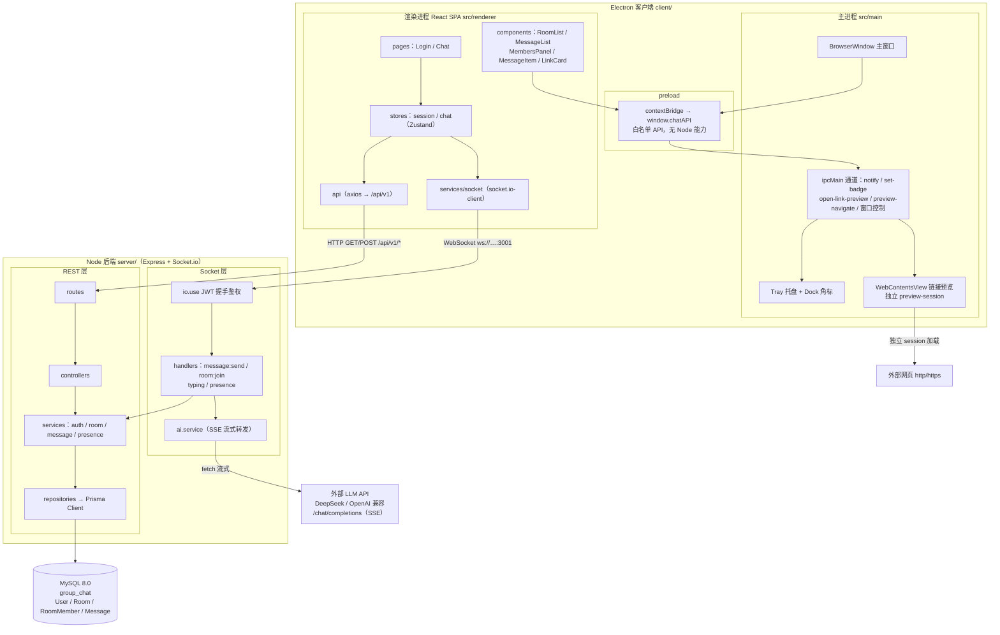

**架构分层职责（对应目录）**：

| 层 | 目录 | 职责 | 禁止事项 |
|---|---|---|---|
| Electron 主进程 | `client/src/main/index.ts` | 窗口、托盘、通知、WebContentsView、ipcMain 通道 | 不承载业务逻辑、不直连数据库 |
| Preload | `client/src/preload/` | contextBridge 暴露 `window.chatAPI` 白名单 | 不暴露 Node/Electron 全量能力 |
| 渲染进程 | `client/src/renderer/src/` | UI + Zustand 状态 + API/Socket 调用 | 不直接使用 Node API、不直接连数据库 |
| 路由层 | `server/src/routes/` | 定义 URL/方法、挂中间件（薄层） | 不写业务逻辑 |
| 控制器层 | `server/src/controllers/` | 参数校验、调用 service、统一响应 | 不直接操作 Prisma |
| 服务层 | `server/src/services/` | 业务逻辑（消息、房间、未读、在线、AI） | 不直接处理 HTTP 细节 |
| 仓储层 | `server/src/repositories/` | Prisma 数据访问封装 | 不写业务判断 |
| Socket 层 | `server/src/sockets/` | 握手鉴权、事件处理、广播 | 不直接写 SQL |
| 部署 | `docker-compose.yml` / `nginx.conf` / `deploy.sh` | MySQL + Server + Nginx 编排与反代 | 容器外不开放 3306/3001 |

---

## 3. 数据模型（Prisma / MySQL）

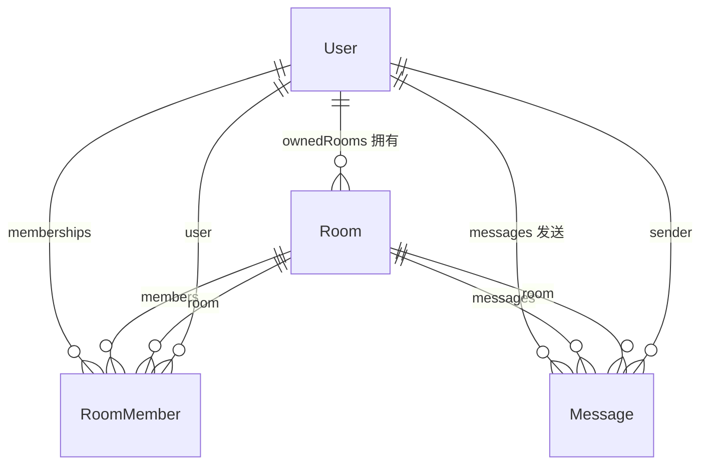

### 3.1 表结构

| 表 | 关键字段 | 索引/约束 | 说明 |
|---|---|---|---|
| `User` | id(uuid), username, passwordHash, nickname, avatarUrl?, status, createdAt | username 唯一 | 真人用户与 AI 机器人（`ai-assistant`）共用一张表 |
| `Room` | id(uuid), name, ownerId, lastMessageAt?, createdAt | — | 房间按最近活跃排序靠 lastMessageAt |
| `RoomMember` | id, roomId, userId, lastReadMessageId?, joinedAt | `@@unique([roomId, userId])`、`@@index([userId])`、级联删除 | 已读位置存最后已读消息 id |
| `Message` | id(uuid), roomId, senderId, clientMsgId?, type(text/system/ai), content, createdAt | `@@unique([senderId, clientMsgId])` 幂等、`@@index([roomId, createdAt])` 游标分页 | AI 消息 type='ai'，同一张表 |

### 3.2 关键口径

- 未读数 = 该房间 `createdAt > 最后已读消息 createdAt` 且发送者不是自己的消息数（`countAfter` 的 `exceptSenderId`）。
- 已读上报 = 更新 `RoomMember.lastReadMessageId`。
- 消息幂等 = `(senderId, clientMsgId)` 唯一；重发同 clientMsgId 直接返回已存在消息。
- 游标分页 = `(roomId, createdAt)` 倒序取 `limit+1`，用下一页首条消息的 createdAt 作 cursor。

---

## 4. 核心数据流

### 4.1 登录认证（REST）

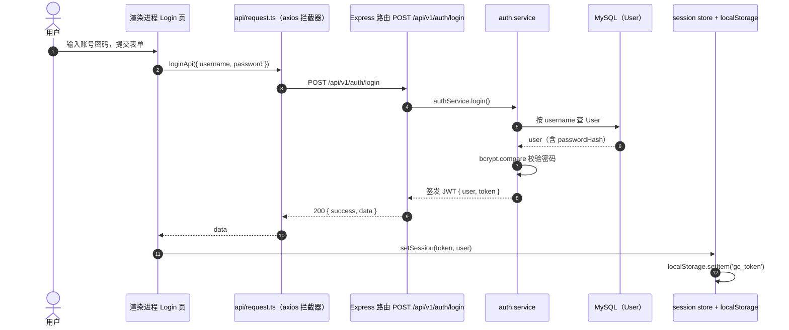

要点：
- 之后所有 REST 请求由 axios 拦截器自动附加 `Authorization: Bearer <token>`；401 时自动清 token 并跳登录。
- Socket 连接握手携带 `auth.token`，服务端 `io.use` 校验同一套 JWT。

代码位置：`client/src/renderer/src/pages/Login.tsx`、`client/src/renderer/src/api/request.ts`、`client/src/renderer/src/stores/session.ts`、`server/src/controllers/auth.controller.ts`、`server/src/services/auth.service.ts`。

### 4.2 建立 Socket 连接 + 加载房间 + 加入房间

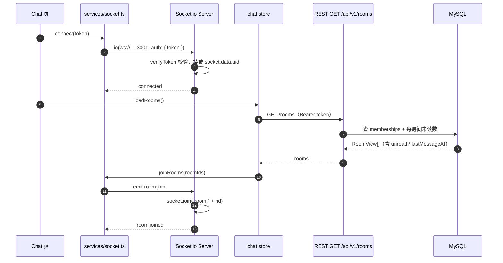

要点：
- 服务端把用户加入个人频道 `user:{uid}`（用于后续在线状态广播逻辑）。
- 房间 Socket 频道命名：`room:{roomId}`。

代码位置：`client/src/renderer/src/pages/Chat.tsx`、`client/src/renderer/src/services/socket.ts`、`client/src/renderer/src/stores/chat.ts`（loadRooms）、`server/src/sockets/index.ts`、`server/src/sockets/handlers.ts`（room:join）。

### 4.3 发送消息（幂等 + ack + 广播）

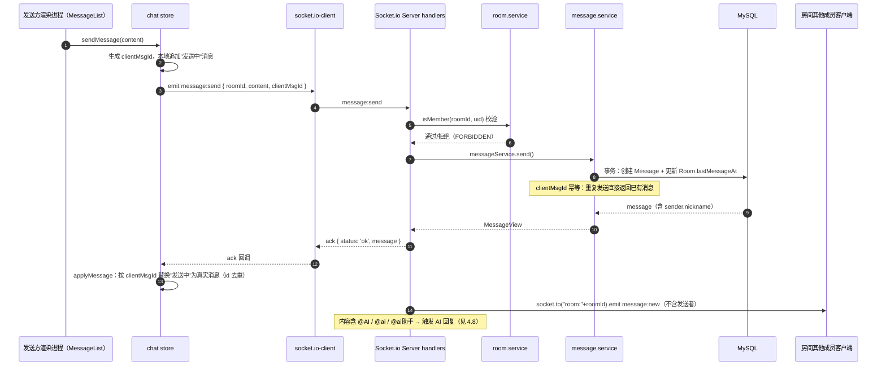

要点：
- 广播用 `socket.to(room)` 排除发送者，避免发送端重复消息；发送端靠 ack 更新本地状态。
- 校验失败或落库失败通过 ack 返回 `{ status:'error', code }`，不断开连接。

代码位置：`client/src/renderer/src/stores/chat.ts`（sendMessage/applyMessage）、`server/src/sockets/handlers.ts`（message:send）、`server/src/services/message.service.ts`、`server/src/repositories/message.repo.ts`。

### 4.4 接收消息 / 未读 / 桌面通知 / 托盘角标

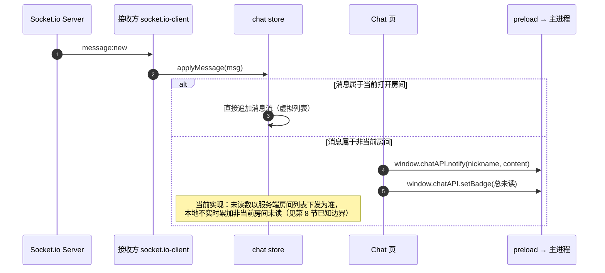

### 4.5 历史消息游标分页 + 已读上报

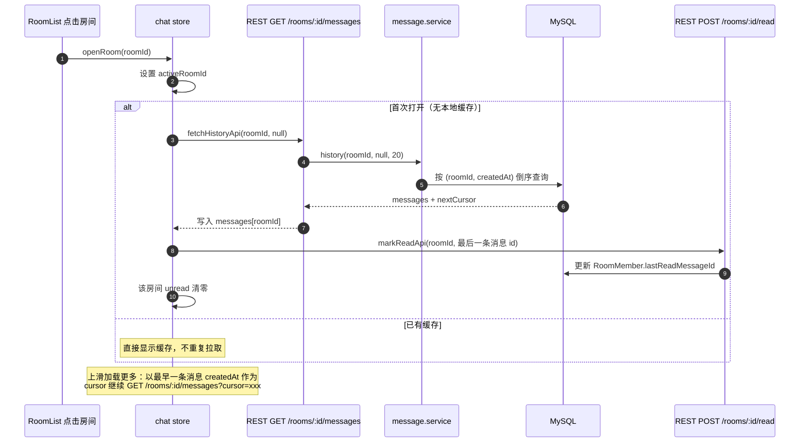

要点：
- 历史查询和已读上报都先做成员校验（非成员 403）。
- 已读上报会校验消息确实属于该房间（防止伪造）。

代码位置：`client/src/renderer/src/stores/chat.ts`（openRoom）、`client/src/renderer/src/api/messages.ts`、`client/src/renderer/src/api/rooms.ts`、`server/src/controllers/message.controller.ts`、`server/src/controllers/read.controller.ts`。

### 4.6 在线状态

```mermaid
sequenceDiagram
    autonumber
    participant A as 用户 A 客户端
    participant IO as Socket.io Server presence.service
    participant B as 用户 B 客户端

    A->>IO: 连接成功
    IO->>IO: presenceService.online(uid, socketId)
    Note over IO: 内存 Map&lt;uid, Set&lt;socketId&gt;&gt;，多端连接合并为在线
    IO->>A: presence:changed { uid, online: true }（全员广播）
    IO->>B: presence:changed { uid, online: true }
    B->>B: chat store online 状态更新 → 成员面板圆点
    A->>IO: disconnect
    IO->>IO: presenceService.offline(uid, socketId)
    Note over IO: 仅当该用户最后一个 socket 断开才判定下线
    IO->>B: presence:changed { uid, online: false }
```

代码位置：`server/src/services/presence.service.ts`、`server/src/sockets/handlers.ts`（connection/disconnect）、`client/src/renderer/src/stores/chat.ts`（applyPresence）、`client/src/renderer/src/components/MembersPanel.tsx`。

### 4.7 输入状态（typing，不落库）

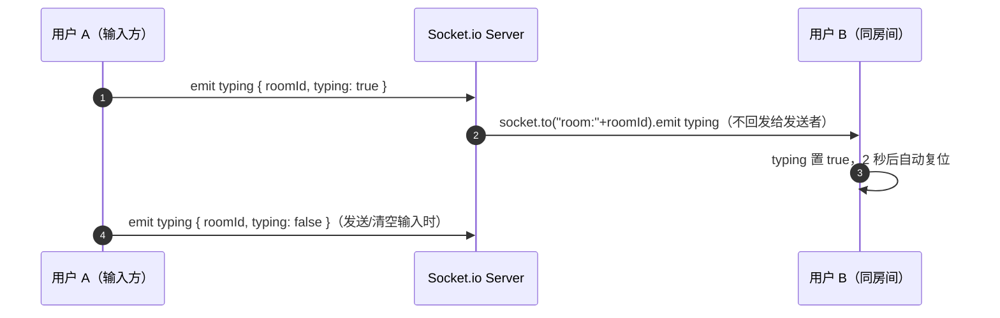

代码位置：`client/src/renderer/src/components/MessageList.tsx`、`client/src/renderer/src/services/socket.ts`（emitTyping/onTyping）、`client/src/renderer/src/stores/chat.ts`（applyTyping）、`server/src/sockets/handlers.ts`（typing）。

### 4.8 AI 机器人流式回复（SSE → Socket 转发）

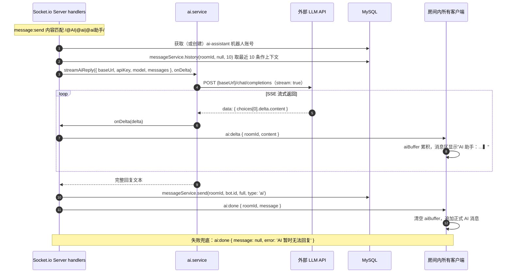

要点：
- AI 回复走与真人相同的落库链路（同一张 Message 表，type='ai'），保证历史/分页/未读一致。
- 上下文按发送者是否为机器人映射 role（assistant/user），系统提示固定中文简洁回答。

代码位置：`server/src/services/ai.service.ts`、`server/src/sockets/handlers.ts`（handleAiReply）、`client/src/renderer/src/stores/chat.ts`（applyAiDelta/applyAiDone）、`client/src/renderer/src/components/MessageList.tsx`（aiBuffer 渲染）。

### 4.9 链接预览（WebContentsView）

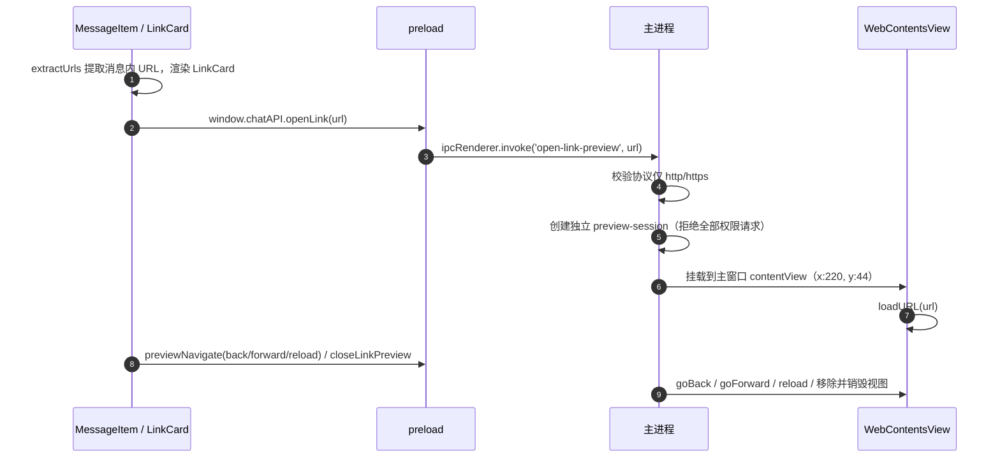

要点：
- 预览视图使用独立 session 分区，不共享主窗口 cookie/权限；sandbox + contextIsolation + nodeIntegration:false。
- 主窗口新开窗口（target=_blank）一律交给系统浏览器（`shell.openExternal`）并 deny。

代码位置：`client/src/main/index.ts`、`client/src/preload/index.ts`、`client/src/renderer/src/components/LinkCard.tsx`、`client/src/renderer/src/utils/url.ts`、`client/src/renderer/src/pages/Chat.tsx`（预览工具栏）。

### 4.10 部署链路（Docker Compose + Nginx）

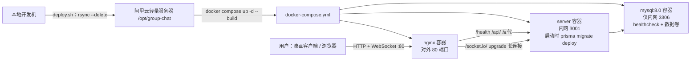

要点：
- 3306 与 3001 不对公网开放，统一经 Nginx 80 端口进入。
- server 容器启动执行 Prisma migration（Dockerfile runner 阶段固定 `prisma@6.19.3`）。

代码位置：`docker-compose.yml`、`nginx.conf`、`deploy.sh`、`server/Dockerfile`。

---

## 4.11 加入房间三入口（已实现）

> 本节三个入口已于 2026-08-18 实现落地，接口清单见第 5 节。

### 4.11.1 入口一：输入房间 ID / 粘贴邀请链接加入

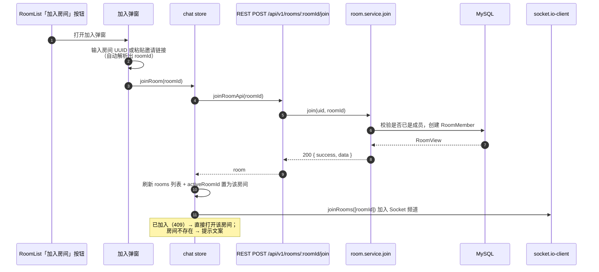

要点：
- 复用现有 `POST /api/v1/rooms/:roomId/join`，后端无需新增接口。
- 弹窗输入框支持三种形态并自动解析：裸 UUID、`groupchat://join?roomId=xxx` 深链、`http(s)://…/join?roomId=xxx` 链接。
- 加入成功后按 4.2 流程并入 Socket 频道，无需刷新页面。

代码位置：`client/src/renderer/src/api/rooms.ts`（joinRoomApi）、`client/src/renderer/src/stores/chat.ts`（joinRoom）、`client/src/renderer/src/components/RoomList.tsx`（加入弹窗）、`client/src/renderer/src/utils/url.ts`（buildInviteLink / parseJoinInput）。

### 4.11.2 入口二：邀请链接（复制 + 系统深链）

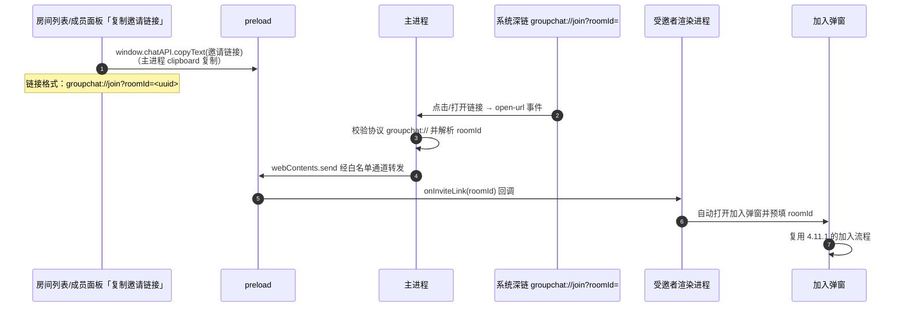

要点：
- 主进程 `app.setAsDefaultProtocolClient('groupchat')`，macOS 处理 `open-url` 事件，Windows/Linux 处理 `second-instance`。
- 系统事件一律经 preload 白名单通道进入渲染进程（`window.chatAPI.onInviteLink`），渲染进程不直接订阅系统事件。
- 复制与接收两端的链接解析共用 `utils/url.ts`，保证格式一致。

代码位置：`client/src/main/index.ts`（协议注册 + open-url/second-instance + copy-text IPC）、`client/src/preload/index.ts`（copyText / onInviteLink 白名单通道）、`client/src/renderer/src/pages/Chat.tsx`（监听后派发 gc:invite-open）。

### 4.11.3 入口三：成员面板邀请（按账号拉人）

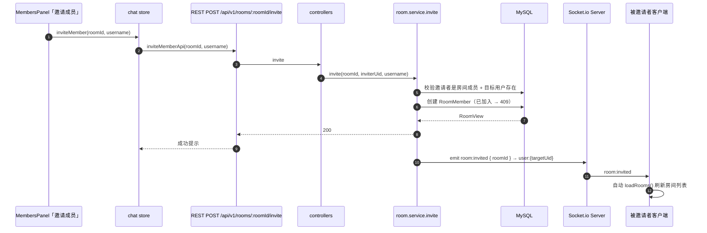

要点：
- 权限决策：任意房间成员可邀请（不限制仅房主）。
- 被邀请者在线时经 `user:{uid}` 频道实时收到 `room:invited` 并刷新列表；离线则下次登录加载房间列表时自然出现。
- 服务端分层：routes → controllers → room.service.invite → room.repo，不绕过 repository。

代码位置：`server/src/services/room.service.ts`（invite）、`server/src/controllers/room.controller.ts` + `server/src/routes/rooms.ts`（POST invite）、`server/src/sockets/io.ts`（setIo/getIo）、`client/src/renderer/src/api/rooms.ts`（inviteMemberApi）、`client/src/renderer/src/stores/chat.ts`（inviteMember）、`client/src/renderer/src/components/MembersPanel.tsx`（邀请弹窗）、`client/src/renderer/src/services/socket.ts`（onRoomInvited）。

---

## 5. 接口清单（改动需同步本文档）

### 5.1 REST API

| 方法 | 路径 | 鉴权 | 说明 |
|---|---|---|---|
| POST | `/api/v1/auth/register` | 无 | 注册（当前客户端无注册页，用 API 或后续补 UI） |
| POST | `/api/v1/auth/login` | 无 | 登录，返回 `{ user, token }` |
| GET | `/api/v1/rooms` | Bearer | 当前用户房间列表（含 unread/memberCount/lastMessageAt） |
| POST | `/api/v1/rooms` | Bearer | 创建房间（同时创建者自动成为成员） |
| POST | `/api/v1/rooms/:roomId/join` | Bearer | 加入房间（重复加入 409） |
| GET | `/api/v1/rooms/:roomId/members` | Bearer | 房间成员列表 |
| GET | `/api/v1/rooms/:roomId/messages?cursor=&limit=` | Bearer | 历史消息游标分页（limit 1-100，默认 20） |
| POST | `/api/v1/rooms/:roomId/read` | Bearer | 已读上报 `{ lastReadMessageId }` |
| POST | `/api/v1/rooms/:roomId/invite` | Bearer | 邀请用户入房 `{ username }`（见 4.11.3） |
| GET | `/health` | 无 | 健康检查（部署验收用） |

统一响应：`{ success, data }` 或 `{ success: false, error: { code, message } }`。

### 5.2 Socket 事件

| 方向 | 事件 | 载荷 | 说明 |
|---|---|---|---|
| C→S | `room:join` | `roomIds: string[]` | 加入房间频道，回 `room:joined` |
| C→S | `message:send` | `{ roomId, content, clientMsgId }` + ack | 落库后 ack，广播 `message:new` |
| C→S | `typing` | `{ roomId, typing }` | 仅同房间转发，不落库 |
| S→C | `message:new` | `MessageView` | 房间广播（排除发送者） |
| S→C | `room:joined` | `{ roomIds }` | 入房确认 |
| S→C | `presence:changed` | `{ uid, online }` | 全员广播在线状态 |
| S→C | `typing` | `{ roomId, uid, typing }` | 输入状态 |
| S→C | `ai:delta` | `{ roomId, content }` | AI 流式增量 |
| S→C | `ai:done` | `{ roomId, message \| null, error? }` | AI 完成/失败 |
| S→C | `room:invited` | `{ roomId }` | 被邀请者实时刷新房间列表（见 4.11.3） |

握手：`io.use` 从 `socket.handshake.auth.token` 校验 JWT，失败拒绝连接。

### 5.3 preload/IPC 深链与剪贴板通道（见 4.11.2）

| 通道 | 方向 | 说明 |
|---|---|---|
| `window.chatAPI.copyText(text)` | 渲染→主进程 | 主进程 clipboard 复制任意文本（含 `groupchat://join?roomId=xxx` 邀请链接） |
| `window.chatAPI.onInviteLink(cb)` | 主进程→渲染 | 深链触发后回调，打开加入弹窗并预填 |

---

## 6. 目录 ↔ 架构映射

```
group-chat/
├── client/                          # 第 2 节 CLIENT 分区
│   ├── src/main/index.ts            # 主进程：窗口/托盘/通知/WebContentsView/ipcMain
│   ├── src/preload/index.ts         # window.chatAPI 白名单桥接
│   └── src/renderer/src/
│       ├── pages/Login.tsx Chat.tsx # 页面编排
│       ├── stores/session.ts chat.ts# 状态：会话、房间、消息、在线、typing、AI buffer
│       ├── services/socket.ts       # socket.io-client 封装（唯一 Socket 出口）
│       ├── api/                     # axios 封装（唯一 REST 出口）
│       └── components/              # RoomList/MessageList/MembersPanel/MessageItem/LinkCard
├── server/                          # 第 2 节 SERVER 分区
│   ├── src/app.ts                   # Express 装配（helmet/cors/json/路由/404/错误）
│   ├── src/index.ts                 # HTTP + Socket.io 启动
│   ├── src/routes/                  # REST 路由（薄层）
│   ├── src/controllers/             # 校验 + 调 service + 统一响应
│   ├── src/services/                # auth/room/message/presence/ai 业务逻辑
│   ├── src/repositories/            # Prisma 访问封装
│   ├── src/sockets/                 # 握手鉴权 + 事件 handlers
│   ├── src/middleware/              # requireAuth / errorHandler
│   ├── src/utils/                   # prisma/jwt/logger/response
│   └── prisma/schema.prisma         # 数据模型 + migrations
├── docs/                            # 本文档、交接文档、设计文档、计划
├── docker-compose.yml               # mysql + server + nginx 编排
├── nginx.conf                       # /api 反代 + /socket.io upgrade
└── deploy.sh                        # rsync + compose up + 健康检查
```

---

## 7. 错误处理与日志约定

- REST：控制器捕获已知错误转统一错误码（如 `USERNAME_TAKEN` 409、`BAD_CREDENTIALS` 401、`FORBIDDEN` 403、`VALIDATION_ERROR` 400）；未知错误由全局 errorHandler 兜底 500。
- Socket：业务错误通过 ack 返回 `{ status:'error', code }`，不断开连接；校验失败（非成员）返回 `FORBIDDEN`。
- 日志：服务端 pino 结构化日志，AI 调用记录耗时；客户端错误用 toast 提示，401 自动跳登录。

---

## 8. 已知边界与待完善点（现状即文档）

| 项目 | 现状 | 在架构中的位置 |
|---|---|---|
| 断线重连 | socket.io-client 自动重连，但当前实现重连后不会自动重发 `room:join`（需刷新或重新登录） | 4.2 流程，`services/socket.ts` |
| 未读实时累加 | 非当前房间收到新消息只触发通知/角标，房间未读数不本地自增；以服务端房间列表下发为准 | 4.4 流程，`stores/chat.ts` |
| 注册页 | 客户端只有登录页，注册走 API | 4.1 流程，`pages/` |
| AI Key | `server/.env` 配置 `AI_BASE_URL/AI_API_KEY/AI_MODEL`，未配置时 AI 回复兜底文案 | 4.8 流程，`services/ai.service.ts` |
| 历史分页加载更多 | 前端 API 支持 cursor，但 MessageList 尚未接"上滑加载更多"交互 | 4.5 流程，`components/MessageList.tsx` |
| 邀请成员按钮 | 已实现：成员面板邀请弹窗 + `room:invited` 实时刷新（见 4.11.3） | `components/MembersPanel.tsx` |

> 后续若完善上述任一项，必须沿用本文档对应流程的通道与分层，不另起炉灶。

---

## 9. 开发检查清单（防跑偏）

提交/验收前逐项自查：

- [ ] 功能可映射到第 2 节架构图的某层/某模块，且无跨层绕过
- [ ] 系统能力全部经 `window.chatAPI`（preload 白名单）调用
- [ ] 实时性需求走 Socket，查询/一次性写库走 REST，通道未互换
- [ ] 数据模型变更已更新第 3 节并生成 Prisma migration
- [ ] 新增 REST/Socket 接口已登记第 5 节清单
- [ ] 新流程已按第 4 节风格补充时序图
- [ ] 服务端分层：routes → controllers → services → repositories，无直连 Prisma 的业务代码
- [ ] 测试（`npm run test -w server` / `npm run test -w client`）与类型检查（`npm run build -w client`）通过

---

## 10. 变更记录

| 版本 | 日期 | 变更内容 | 变更人 |
|---|---|---|---|
| v1.0 | 2026-08-17 | 依据 `docs/handoff.md` 与 `feat/group-chat-implementation` 分支实现，产出首版架构与数据流图 | Codex |
| v1.1 | 2026-08-17 | 新增 4.11「加入房间三入口」规划：输入房间 ID 加入 / 邀请链接深链 / 成员面板邀请；接口清单登记 invite API、`room:invited` 事件与深链 IPC 通道（均标注规划中，未覆盖 v1.0 内容） | Codex |
| v1.2 | 2026-08-18 | 4.11 三入口全部实现：后端 invite（e0440ba）、客户端 joinRoom/邀请链接（5996e12）、深链 + copyText（863067f）、成员邀请 + room:invited（3c82364）；5.3 通道按实际实现更新为 copyText / onInviteLink；接口清单去掉规划标注 | Codex |
